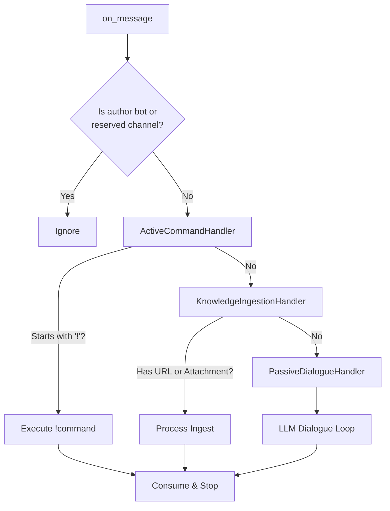

# Project Specification: MindSpace Hierarchical Knowledge Agent

## 1. Project Goal & Philosophy

Create an AI agent that acts as a cognitive partner across three primary functions: **Thought Recording**, **Knowledge Base Management**, and **Research**.

**Philosophy:** "Discord as the Input Stream, Filesystem as the Source of Truth."

The system uses **VikingContextManager** (wrapping OpenViking) for context navigation and **PageIndexManager** (wrapping PageIndex) for deep PDF document reasoning, resulting in a human-readable, self-organizing filesystem backed by **Git** for full auditability.

---

## 2. Technical Stack

- **Dialogue Brain:** Google GenAI SDK (`google-genai`) — passive chat, URL/file analysis, commit messages (`DIALOGUE_BRAIN_TYPE = "GoogleGenAISdk"`)
- **Command Brain:** Gemini CLI (`gemini -y`) — agentic `!organize` / `!research` / `!omni` with web search, file I/O, multi-step loops (`COMMAND_BRAIN_TYPE = "gemini-cli"`)
- **Language:** Python 3.12+
- **Semantic Search:** [OpenViking](https://github.com/volcengine/OpenViking) — wrapped by `VikingContextManager` in `viking.py`; fully integrated
- **PDF Reasoning:** [PageIndex](https://github.com/VectifyAI/PageIndex) — wrapped by `PageIndexManager` in `pageindex_manager.py`; fully integrated
- **Front-end:** Discord API (`discord.py`), supporting both `!prefix` and `/slash` commands
- **Version Control:** Git (one repository per Discord Server, stored at `BASE_STORAGE_PATH`)

---

## 3. Architecture & Filesystem Mapping

### 3.1 The "One Server = One Repo" Rule (Single-Server Intent)

**Strict Constraint:** This bot is designed to serve exactly **one** Discord server.
- Each Discord Server maps to a single Git repository at `BASE_STORAGE_PATH` (default: `~/repos/Thought`).
- If the bot is invited to a second server, it will automatically log an error and leave the second server immediately.
- This ensures absolute data isolation and simplifies the filesystem mapping logic.

### 3.2 Hierarchy Logic (Macro-to-Micro)

#### Human-Controlled Zone (Rigid)
- Discord Channels map 1:1 to top-level folders (e.g., `#machine-learning` → `Channels/machine-learning/`).
- Every channel folder contains one core file, initialized automatically:
  - `stream_of_conscious.md` — running log of AI-extracted insights

#### AI-Controlled Autonomous Zone (Fluid)
- Inside each channel folder, the agent has freedom to create semantically nested sub-folders (e.g., `Machine_Learning/Neural_Networks/Transformers/`).

#### View Hierarchy (Progressive Disclosure)
- Any folder under a channel may hold its own `view.md` — a distilled **stance / opinion / conclusion** for that scope. Evidence files in the same folder are the *facts, logic, and theory* that support or challenge it.
- The channel-root `view.md` is the roll-up over its subtree; each subfolder view expresses the user's local position. Same filename at every level — hierarchy, not nomenclature, carries the meaning.
- Views are **opinions, not sources** — so they are excluded from the OpenViking index to keep semantic retrieval grounded in evidence. The chain is read directly from disk via `get_view_chain(channel, rel_folder)`.

---

## 4. Message Handling Flow (Chain of Responsibility)

The bot processes incoming messages through a modular chain of handlers. Each handler inspects the message and either consumes it (halting the chain) or passes it to the next handler.



- **ActiveCommandHandler**: Fast-path for explicit user commands.
- **KnowledgeIngestionHandler**: Automatic processing of shared resources (links/files).
- **PassiveDialogueHandler**: Fallback handler that engages the LLM for natural conversation and background KB maintenance.

---

## 5. Module Responsibilities

| Module | Responsibility |
| :--- | :--- |
| `bot.py` | Discord event loop (`on_message`), command routing (prefix `!` and slash `/`), startup sync. Single `KnowledgeBaseManager` instance (`self.kb`) initialized in `on_ready`. `on_guild_join` enforces the single-server constraint by leaving immediately if `self.kb` is already set. |
| `services.py` | Core business logic for all active commands (`!organize`, `!consolidate`, `!research`, `!omni`, `!change_my_view`) plus the view-tree challenger (`challenge_local_view`, `check_upward_consistency`, `check_downward_consistency`, `handle_view_down_check`). |
| `prompts.py` | Centralized repository for all LLM prompt templates used by the agent and services. |
| `agent.py` | LLM abstraction. `GoogleGenAIBrain` for dialogue (chat, URL/file analysis, commit messages). `GeminiCLIBrain` for commands — exposes `stream(prompt, cwd)` returning a `CliStream` async-iterable handle; env (`GEMINI_CLI_HOME`) and args (`-y`, `-m`) are always injected. |
| `manager.py` | Filesystem writes, Git commits, orchestrated `save_state` (commit + indexing; returns `{touched, sha}` so callers can drive the view-tree challenger), per-channel conversation history, stream reads, and the hierarchical view helpers (`read_view`, `write_view`, `get_view_chain`, `list_subfolders_with_content`, `read_folder_context`). |
| `tools.py` | `MindSpaceTools`: closure-bound tool functions exposed to the LLM during passive dialogue (list files, search channel KB, search global KB, read hierarchical view chain, record thought, propose update). |
| `viking.py` | `VikingContextManager`: OpenViking wrapper; channel-scoped and global semantic search modes |
| `pageindex_manager.py` | `PageIndexManager`: PageIndex cloud API wrapper; PDF upload, async processing, channel-scoped deep Q&A |
| `mcp_bridge.py` | MCP (Model Context Protocol) integration. Handles two-pronged sync: rendering `config.yaml` servers into Gemini CLI's `settings.json` for active commands, and managing an `MCPSessionPool` for native SDK tool use in passive dialogue. |
| `config.py` | Centralized configuration for paths, models, brain type, history char limit, ignored extensions, and MCP server definitions. |
| `logger.py` | Dual-output logger: console (all levels) + Discord `#system-log` (INFO and above, guild-scoped) |

---

## 5. Memory & Context Architecture

### 5.0 Design Principle: Tool-First Architecture

**Core rule:** every structured behavior the bot performs during dialogue — retrieving data, recording insights, triggering side-effects — is expressed as a **typed tool call**, never as an in-band text convention parsed from the model's reply.

**Why this is future-proof:**

1. **Stable API contract.** A tool has a name, typed parameters, and a return value. This is a schema the model is trained to invoke correctly. As models improve, their tool-calling accuracy increases. In contrast, prompt conventions ("append THOUGHT: at the end") rely on the model following arbitrary formatting instructions — a capability that degrades, changes, or gets ignored across model versions and providers.

2. **Composable extension.** Adding a new capability means writing a new function and exposing it. Adding a parameter to an existing capability (e.g. `record_thought(summary, category)`) is a one-line schema change. The equivalent in prompt engineering is another paragraph of instructions competing for the model's attention, with no type checking and no guarantee the model will follow it.

3. **Observable and debuggable.** Tool calls are discrete events: logged, wrapped, intercepted. The bot's async wrapper decorates each call with a progress message visible to the user in Discord. Prompt-based conventions are invisible until you parse the model's output and discover it deviated.

4. **Decoupled from the model.** Tools are pure Python functions. They work the same whether called by Gemini, GPT, Claude, or a future model. Prompt hacks are model-specific — what works for one model's instruction-following may break on another.

5. **Testable in isolation.** Each tool can be unit-tested independently of the LLM. Prompt conventions can only be tested end-to-end by running the full model and hoping it produces the right format.

**Applied examples in MindSpace:**

| Behavior | Old (prompt engineering) | New (tool-first) |
| :--- | :--- | :--- |
| Record insight | Model appends `THOUGHT: [summary]` to reply; bot parses via `str.split("THOUGHT:")` | Model calls `record_thought(summary)` — typed, logged, wrapped with progress UI |
| KB retrieval | `stream_of_conscious.md` pre-injected into system prompt (model skips tools since data is already present) | No pre-loaded KB; model MUST call `search_channel_knowledge_base(query)` to get data |
| Future: tag/categorize | Would require "append TAG: category" + another string parser | Add `category: str` parameter to `record_thought` |

### 5.1 Memory Layers

The agent maintains two layers of memory per channel:

| Layer | Storage | Scope | Reset on restart? |
| :--- | :--- | :--- | :--- |
| **Short-term** | In-memory bounded string (`CONVERSATION_HISTORY_MAX_CHARS = 8000` chars), trimmed at message boundaries | Current session | Yes (re-seeded from Discord history on startup) |
| **Long-term** | `stream_of_conscious.md` on disk | Persistent across restarts | No |

### 5.2 Tools-First Dialogue (No Pre-Loaded KB Context)

On every passive dialogue message, the agent receives a **minimal** system context:

```
[System Context]
  - Channel identity
  - Recent conversation history (char-bounded, oldest messages trimmed first)
  - Instruction: "You do NOT have any pre-loaded knowledge about this channel.
    All channel-specific information MUST be retrieved via tools."

[Available Tools]
  - search_channel_knowledge_base(query)  — Viking semantic search, channel-scoped
  - search_global_knowledge_base(query)   — Viking semantic search, all channels
  - list_channel_files()                  — directory tree of the channel folder
  - list_global_files()                   — directory tree of all channels
  - get_view_chain(rel_folder)            — read the hierarchical view.md chain from a scope up to channel root
  - record_thought(summary)               — persist an insight to stream_of_conscious.md
  - propose_update(path, instruction, …)  — stage a reviewed edit to a KB file (view.md excluded — managed by the challenger)

[Current Message]
  - User's latest message
```

**Why tools-first?** The dialogue brain receives **no** pre-injected KB data (no `stream_of_conscious.md`, no Viking results). The model MUST call `search_channel_knowledge_base` to retrieve factual context. This ensures:
- **Tool calls are the primary data path**, not a redundant fallback the model skips.
- **Progress UI works** — each tool invocation triggers a visible status update in Discord.
- **Prompt stays lean** — no token cost for KB context the model doesn't need.

The conversation history is embedded in the system context string and the brain's `achat()` call receives an empty turn list. After each reply, the turn is appended to the in-memory history string and trimmed if over the char limit.

### 5.3 Thought Recording via `record_thought` Tool

When the user shares a valuable insight, analysis, or conclusion, the model calls `record_thought(summary)` — an explicit tool invocation that appends the summary to `stream_of_conscious.md` via `kb.append_thought()`. The model is instructed to do this silently (no mention in its reply to the user).

This replaces the previous approach of appending `THOUGHT: [summary]` as in-band text at the end of the reply and parsing it via string split. The tool-based approach is type-safe, model-version-stable, and exercises the progress UI.

### 5.4 Progress UI — Async Tool Wrappers

In `bot.py`, each tool is wrapped in an async decorator before being passed to the brain. The wrapper:
1. Edits the Discord status message to show `🔧 module.tool_name — first line of docstring`.
2. Executes the underlying (sync) tool via `asyncio.to_thread` so blocking calls (Viking search, filesystem walk) don't stall the event loop.

The status message (`🧠 **Thinking...**`) is sent before the brain call and deleted after the reply lands. Tool wrappers use `functools.wraps` to preserve function metadata for the Google GenAI SDK's schema extraction.

### 5.5 Startup Seeding

On `on_ready`, the bot:
1. Scans Discord channel history (last 50 messages per channel) and seeds the in-memory history cache (`_seed_channel_history`).
2. Creates Discord channels for any KB folders that don't have a matching Discord channel (`_sync_kb_channels`).
3. Runs `viking.rebuild_index()` and `pageindex.rebuild_index()` for a full initial sync.

---

## 6. VikingContextManager: Two-Mode Context

`viking.py` wraps OpenViking with two explicit modes:

| Mode | Method | Trigger | Scope |
| :--- | :--- | :--- | :--- |
| **Channel-scoped** | `get_channel_context(channel_name, query)` | All default operations | Current channel folder only |
| **Global** | `get_global_context(query)` | `!omni` and `search_global_knowledge_base` tool | All channel folders in the server |

**Indexing strategy — incremental, duplicate-free:**

OpenViking stores the vectors, but does not tell the bot which on-disk files it has already seen. To avoid re-indexing unchanged files on every restart (and, worse, accumulating duplicate vectors), `viking.py` maintains its own bookkeeping cache.

**The cache:** `BASE_STORAGE_PATH/.viking_index.json` (e.g. `Thought/.viking_index.json`) — a small JSON file owned by the bot, **not** by OpenViking. Structure:

```json
{
  "<rel_path_under_Channels>": {"mtime": <float>, "uri": "viking://..."}
}
```

Keys are file paths relative to `Channels/`. Values track the file's mtime at the time of indexing and the resource URI returned by `add_resource()`. Writes are atomic (`tmp + os.replace`) so a crash mid-write cannot corrupt it.

| | Cache (bot) | OpenViking store |
| :--- | :--- | :--- |
| Location | `Thought/.viking_index.json` | `Thought/openviking/` |
| Owner | `VikingContextManager` | OpenViking library |
| Contents | `{file → mtime, uri}` bookkeeping | Vectors + SQLite DB |
| Size | Kilobytes | Large (grows with KB) |

**`index_file(path, channel)` — idempotent:**
- Unchanged (`cached.mtime >= disk.mtime`) → no-op, returns True. Critical duplicate-prevention path.
- Modified → `client.rm(cached.uri)` to delete the stale vector, then `add_resource()`, update cache entry.
- New → `add_resource()`, write cache entry.
- Cache persisted on every successful add.

**`rebuild_index()` — sync, not rebuild:**
- **Cold start** (cache file missing or corrupted): `client.rm("viking://resources/", recursive=True)` wipes the store, then everything on disk is re-indexed from scratch. This is the self-healing path — also runs if the user manually deletes the cache to force a clean rebuild.
- **Warm start** (cache present): walks `Channels/*/**/*.md`, compares mtimes to the cache, and only touches the delta — new files added, modified files re-added after `rm`, deleted files purged via `rm` and dropped from the cache. Logs a summary: `N new, M modified, K removed, U unchanged, F failed`.

**Orchestrated Persistence (`save_state`):**
The `KnowledgeBaseManager` decouples the source-of-truth (Git) from derived semantic indexes (Vector DB). 
- **`git_commit(message)`**: Performs a surgical Git commit of the `Channels/` directory.
- **`index_files(paths)`**: Incremental indexing of specific changed files in both OpenViking and PageIndex.
- **`save_state(message)`**: The primary orchestrator. It finds all modified/untracked files in `Channels/`, performs a `git_commit`, and then triggers `index_files` on the delta. This ensures the repo and the DB stay in sync for all major events (file drops, active commands, research).

**Lazy Thought Indexing:**
During passive dialogue, the `record_thought` tool appends insights to `stream_of_conscious.md` on disk. To avoid excessive Git noise and I/O overhead, these updates do **not** trigger an immediate commit or re-index. Instead, they are lazily picked up and indexed during the next naturally occurring `save_state` (e.g., when the user eventually drops a file or runs an active command).

### 5.6 View-Tree Challenger (Event-Driven Consistency)

The view hierarchy stays honest through an event-driven challenger wired into `save_state`. Every time a commit lands in `Channels/`, `save_state` returns the set of `(channel, rel_folder)` tuples that were touched; the bot's `save_and_challenge` wrapper then dispatches the appropriate consistency check as a background `asyncio` task.

**Governing principle — master vs subfolder views.** Users can only *initiate* updates to the channel-root (master) view, via `/change_my_view`. Subfolder views are exclusively **LLM-initiated**: only the challenger and the consistency checks ever propose changes to them. However, every view change at any level still goes through the proposal UI (Apply / Discard / Refine) for user approval — nothing about `view.md` is ever written to disk without a deliberate click. The distinction is about *who initiates*, not about *who approves*.

Three primitives live in `services.py`:

| Primitive | Trigger | Effect |
| :--- | :--- | :--- |
| `challenge_local_view(channel, rel_folder)` | Content-file commit in `rel_folder` | Distills a fresh view from the folder's evidence via `DISTILL_LOCAL_VIEW_PROMPT`. On `VIEW_OK` sentinel, no-op. Otherwise emits a proposal for `<rel_folder>/view.md`. Lazy-bootstraps a view when the folder has content but no existing view. |
| `check_upward_consistency(channel, rel_folder)` | **Every content commit in `rel_folder`** (fires alongside `challenge_local_view` — new information always propagates upward), and additionally whenever a `view.md` proposal at `rel_folder` is accepted | Walks each ancestor view, runs `DETECT_VIEW_CONFLICT_PROMPT` between it and the current descendant view. Emits one proposal per conflicting ancestor, subfolder or root. |
| `check_downward_consistency(channel, rel_folder)` | A `/change_my_view` proposal is accepted (or the view-down-check sweep) | Same prompt inverted — walks every descendant view and emits a proposal per child that now disagrees with the parent. |

**Direction-gating.** A view-file commit cannot re-trigger its own local challenge — that would loop on itself. `save_and_challenge(view_scope=…)` dispatches only the ancestor walk after a view commit, and the caller (`ProposalView.apply`) sets `view_scope` based on whether the accepted path ends in `view.md`.

**Cascade tagging.** Most view-proposal acceptances should propagate only upward (the challenger already emitted the local update deliberately — children weren't surprised). `/change_my_view` is the exception: it represents direct user intent at the root, so its proposal is tagged `cascade="both"` and its acceptance fires both upward and downward sweeps.

**No periodic loop.** There is no background scheduler. Drift that slips through the event-driven path (e.g., multi-folder commits, long-quiet channels) is reconciled by the manual `/view_down_check` command, which local-challenges every content folder in the channel and then runs a downward consistency pass from the root.

**Proposal protection.** `handle_propose_update` (the dialogue tool's entry point) refuses any path whose basename is `view.md`, at every depth. View edits only enter the filesystem through the challenger, the conflict detector, or `/change_my_view` — never through ambient dialogue.

### 5.7 KB Maintenance: The "Instruction-Based Delegate" Pattern

For structured KB maintenance (updating existing `.md` files, models, or research articles), the agent uses the `propose_update` tool. This follows a specialized **Stateless Rewrite Agent** architecture to ensure safety and prevent **Context Window Bloat**.

**The Problem:** Asking the Dialogue LLM to rewrite a large KB file (e.g., a 2000-line document) within the conversation history would quickly exceed token limits and pollute the chat with redundant content.

**The Solution:**
1.  **Instruction Only:** The Dialogue LLM only provides a high-level `instruction` (e.g., "Add polling data for April") and a `rationale`. It never sees the full file content unless specifically requested.
2.  **Stateless Delegate:** When `propose_update` is called, a separate, isolated, one-shot LLM call (the Rewrite Agent) is spawned. It reads the file, applies the instruction, and returns the *proposed* content. This content **never** enters the persistent conversation history.
3.  **Memory-Based Staging:** The proposed content is stored in a `pending_proposals` dictionary in memory. The disk is **never touched** at this stage.
4.  **Human-in-the-loop (Git Diff):** The bot renders a color-coded Git-style diff in Discord (using `difflib`) for user review.
5.  **Commit on Approval:** The file is only written to disk and committed to Git (`kb.save_state`) once the user clicks **Apply**. Clicking **Discard** clears the memory, and **Refine** triggers another stateless rewrite based on feedback.

**Invariant:** Staged proposals are volatile (cleared on bot restart) and isolated (do not affect `git status` or semantic indexing until applied). This prevents "dirty" unapproved edits from being swept up by background tasks like `!organize`.

**Invariant:** cache file present ⇔ OpenViking store matches cache. Deleting the cache is always safe; the store will self-heal on next startup.

---

## 7. PageIndexManager: PDF Deep Reasoning

`pageindex_manager.py` wraps the PageIndex cloud API:

- PDFs are submitted to a per-channel cloud folder and processed asynchronously (polled until ready).
- A local `.pageindex_index.json` persists `{file_path → doc_id}` and `{channel → folder_id}` mappings across restarts to avoid re-uploading.
- `query_channel()` runs deep Q&A against all indexed PDFs in a channel using `chat_completions`.
- `rebuild_index()` is called at startup to submit any untracked PDFs.

---

## 8. Core Workflows (Commands)

| Trigger | Action | Output file |
| :--- | :--- | :--- |
| `!organize` / `/organize` | Scans untracked files, runs semantic reasoning, git commit | — |
| `!consolidate` / `/consolidate` | Synthesizes `stream_of_conscious.md` into a permanent article, clears stream, git commit | `ARTICLE-<date>-<subject>.md` |
| `!research [topic]` / `/research` | Deep-dive on topic using Viking + PageIndex context, git commit | `RESEARCH-<date>-<subject>.md` |
| `!omni [query]` / `/omni` | Cross-KB synthesis across **all** channel folders (global Viking traversal), git commit | `OMNI-<date>-<subject>.md` |
| `!change_my_view [instruction]` / `/change_my_view` | Update the channel-root view via a reviewed proposal. Accepting also fires a downward consistency sweep that emits proposals for every subfolder view that drifts. | `view.md` |
| `!view_down_check` / `/view_down_check` | Top-down sweep: re-challenge every content folder's local view, then a downward consistency sweep from the channel root. | — |
| `!sync` / `/sync` | Manually rebuild the vector index for the current channel | — |
| URL in message | Replies instructing user to paste content manually | — |
| File attachment (no @mention) | Content-routed ingestion: LLM picks a subfolder within the channel and renames by content, git commit | — |
| File attachment (@mention + `.md`) | Reviewed ingest: LLM merges draft into an existing KB file or creates a new one; surfaces via the Apply/Discard/Refine proposal UI. Any extra text is optional steering advice. | — |
| File attachment (@mention + non-`.md`) | Content-routed ingestion, but the mention text is threaded into the routing prompt as an advice hint | — |
| Plain text | Passive dialogue: replies via tools-first KB retrieval. May silently record insights via `record_thought`, or actively trigger the Apply/Discard/Refine proposal UI via the `propose_update` tool. | — |

All output `.md` files are sent back to the Discord channel as Discord file attachments immediately after creation.

### 8.1 File Drop Branching

The `message.attachments` handler in `bot.py:on_message` uses a single predicate to pick its path: **did the user @mention the bot?** The mention is the explicit "I want this reviewed" signal. Without it, files are silently autorouted. The extra text the user typed (stripped of the mention token) becomes optional *advice* — never a trigger on its own.

```
mentioned = self.user.mentioned_in(message)
advice    = re.sub(r"<@!?\d+>", "", message.content).strip()   # may be empty
```

| Case | Path | Behavior |
| :--- | :--- | :--- |
| No mention, any file | **Autoroute** (`_handle_file_autoroute`) | Read bytes via `attachment.read()`, build a content snippet (first 5000 bytes for text-ish files; filename only for PDFs/binaries), walk the channel folder for a tree listing, call `agent.route_file` for a `{subfolder, filename}` JSON verdict, sanitize against path traversal, write bytes to the final path (deduped on collision), run `analyze_file` for the PageIndex upload / LLM summary, then `save_state`. |
| @mention + `.md`/`.markdown` | **Reviewed ingest** (`_handle_file_proposal`) | Read draft bytes into memory. `agent.plan_file_proposal` picks `mode: new\|update` and a `target_rel_path` using Viking KB context + the channel tree. `agent.merge_file_proposal` produces the final markdown — for updates, the model may emit the sentinel `NEW_FILE_INSTEAD` to escape to a new-file path if the target turns out to be a poor fit once the fresh disk content is in view. Result goes through `_create_proposal` + `_send_proposal`, reusing the existing `ProposalView` Apply/Discard/Refine UI. Apply performs the write + commit + index. Advice may be empty: the mention alone is enough to request review. |
| @mention + non-`.md` | **Autoroute with advice** | Same as the no-mention autoroute, but the mention text is threaded into `agent.route_file`'s prompt as explicit steering. The proposal UI is `.md`-only because it relies on a readable text diff — for PDFs and binaries the mention still gets you content-aware placement with your words as a hint, just not a preview. |

**Why mention-as-trigger rather than caption-as-trigger?** A caption-based branch conflates "user typed something" with "user wants review," which misfires in both directions: a casual `@bot here.md` with no extra text gets autorouted when the user clearly wanted attention, and a `here's my file lol` caption flips into the heavy path when the user just wanted quiet ingestion. A mention is an unambiguous, intentional signal that the bot should slow down and show its work.

**PDFs route by filename signal alone.** `PageIndexManager` caches uploaded documents by absolute file path (`pageindex_manager.py`), so previewing a PDF's content would require uploading it. The routing LLM call operates on filename + user advice only; after the file lands at its final path, `analyze_file` runs the PageIndex upload exactly once at the correct location.

**No staging.** The earlier design staged attachments in `/tmp` to avoid double-indexing through `save_state`'s untracked-file scan. That complexity is unnecessary: `attachment.read()` returns bytes in memory, and writing them directly to the final path means only one file ever hits disk. One path, one index.

---

## 9. Command Brain: Gemini CLI Execution

Active commands (`!organize`, `!research`, `!omni`) delegate to the Gemini CLI subprocess via `GeminiCLIBrain.stream(prompt, cwd)`. The brain owns all invocation details (spawn, env injection, stdin piping, ANSI stripping); `bot.py` stays agnostic.

### 9.1 Config Isolation — `GEMINI_CLI_HOME`

The CLI is invoked with `GEMINI_CLI_HOME=<BASE_STORAGE_PATH>/bot-home` set in the subprocess env. This reroots the CLI's user-scope config away from `~/.gemini/` to an isolated `Thought/bot-home/.gemini/`:

- `settings.json` — bot-specific config (hooks disabled, notifications off, telemetry off — no shared state with the user's interactive CLI)
- `oauth_creds.json`, `google_accounts.json` — symlinks back to `~/.gemini/` so auth still works
- `bot-home/` is gitignored

The user's interactive `gemini` sessions in a shell remain untouched.

### 9.2 Workspace Sandboxing — `cwd`

Each command sets `cwd` to the smallest directory the CLI needs. In YOLO mode the agent has unrestricted file access inside its workspace, so this is the primary sandbox boundary:

| Command | `cwd` | Scope rationale |
| :--- | :--- | :--- |
| `!organize` | `<channel_path>` | Reorganizes one channel — no cross-channel access needed |
| `!research` | `<channel_path>` | Report is written back into the same channel |
| `!omni` | `Channels/` | Cross-channel synthesis requires sibling reads; still sandboxed from `bot-home/`, `openviking/`, `ov.conf` |

**Config scope and workspace scope are independent.** Because the bot config is loaded as user-scope via `GEMINI_CLI_HOME` (not as workspace settings from `cwd/.gemini/`), `cwd` can be tightened to any subtree without losing the bot config. Headless-mode trust (stdin not a TTY) auto-trusts the workspace, so no folder-trust prompt appears.

### 9.3 Live Streaming

`GeminiCLIBrain.stream()` spawns the subprocess and returns a `CliStream` handle — an async-iterable that yields ANSI-stripped, non-empty lines as the CLI emits them, and exposes `.returncode` once iteration completes. Two consumption patterns:

- **Discord UI** (`!organize`, `!omni`): `bot._render_stream_to_channel(channel, header, handle)` edits a single live Discord message every ~2 seconds with the latest output tail, then marks it complete.
- **Console + interaction edit** (`!research`): the handler iterates `async for line in handle` directly — each line is logged to the server console, and the deferred `/research` interaction's "thinking..." message is updated in place (no follow-up spam).

Either way, the event loop stays responsive throughout the multi-minute CLI run.

---

## 10. Implementation Rules

- **One process per Discord Server.** `KnowledgeBaseManager` is lazy-loaded per guild in `bot.py`.
- **Every active command** (`!` / `/`) is followed by a `git commit` with an AI-generated message explaining intent.
- **Bot is quiet.** No unprompted messages, no pinned maps, no ASCII trees.
- **Instant file delivery.** Every new `.md` file created is sent back to Discord as an attachment.
- **File naming:** all output markdown files use lowercase `.md` extension with `TYPE-DATE-SUBJECT` format, where SUBJECT is a kebab-case slug derived from the topic/query/title (or extracted from the first H1 for consolidate/webpage). This keeps filenames human-scannable in `ls` and searchable by keyword.
- **Preflight check on startup:** validates that PageIndex, OpenViking, and GitPython are installed and that API keys are functional before the Discord connection is established.

### 10.1 Commit Scope — `Channels/` only

The bot's `git_commit()` deliberately stages **only** paths under `Channels/` (`git add Channels`, not `git add -A`). Change detection (`changed_files` / `untracked`) is scoped to the same prefix, so the post-commit indexer never even sees anything outside.

**Why:** `Thought/` also holds `openviking/` (regenerable vector store, churns on every run), `bot-home/` (isolated Gemini CLI config), and local bookkeeping caches (`.viking_index.json`, `.pageindex_index.json`). Letting the bot auto-stage those would pollute the KB history with library runtime noise — and worse, would feed OpenViking's own internal `.md` artifacts back into `index_file()`, producing nonsensical channel names like `..` and corrupting the store.

**Note:** the repo can still track anything you want for manual inspection or archival — `git add -A` by hand is fine, and a full snapshot of `openviking/` state is useful for diffing or debugging. The bot simply refuses to do it for you. Bot commits stay content-only; manual commits can touch anything. The two histories interleave cleanly.

---

## 11. MCP Integration (Model Context Protocol)

MindSpace integrates MCP servers defined in `config.yaml` using a dual-path strategy to ensure consistent tool availability across both dialogue and active commands.

### 11.1 Active Commands (Gemini CLI)

When the bot starts, `mcp_bridge.sync_cli_settings()` reads the `mcp.servers` dictionary from `config.yaml` and renders it into the Gemini CLI's isolated `settings.json` (located at `<BASE_STORAGE_PATH>/bot-home/.gemini/settings.json`).

- This makes all MCP tools (e.g., Wisburg, Google Search) available to `!organize`, `!research`, and `!omni` via the CLI's native agentic loop.
- Servers are added to the `mcpServers` key in the CLI config.

### 11.2 Passive Dialogue (Google GenAI SDK)

For the "passive" chat brain (`GoogleGenAIBrain`), the bot maintains a live `MCPSessionPool`.

- **Connection:** On startup, `MCPSessionPool.connect()` opens persistent `mcp.ClientSession`s over streamable HTTP for each configured server.
- **Discovery:** The pool is passed to the brain during `engage_dialogue`. The Google GenAI SDK natively discovers these as tools and handles the dispatch loop (call → response → repeat) without manual bot intervention.
- **Resilience:** MCP connection failures or timeouts are logged as warnings but do not block the bot from starting, ensuring transient service outages don't take down the entire system.

### 11.3 Configuration

MCP servers are configured in `config.yaml` under the `mcp.servers` key, supporting environment variable expansion (e.g., `${WISBURG_MCP_TOKEN}`):

```yaml
mcp:
  servers:
    wisburg:
      url: https://mcp.wisburg.com/mcp
      headers:
        Authorization: Bearer ${WISBURG_MCP_TOKEN}
```

### 11.4 Understanding MCP Sessions & Workflow

An **MCP Session** is a live JSON-RPC connection (usually over Streamable HTTP/SSE) between the bot and a tool provider. Unlike static API keys, a session is an active channel that allows the LLM to discover and invoke tools dynamically.

**The Execution Workflow:**
1.  **Discovery & Connection:** At startup, `MCPSessionPool` establishes persistent connections to all configured servers and caches each server's tool list via `list_tools()`.
2.  **Injection:** These active sessions are passed to `GoogleGenAIBrain.achat()` as part of the `tools=` list. The SDK automatically advertises the available MCP tools to the Gemini model as functional capabilities via AFC (Automatic Function Calling).
3.  **The Tool Call Loop:**
    *   The LLM decides a tool is needed and emits a call.
    *   The SDK sends a `tools/call` request through the **MCP Session**.
    *   The MCP Server executes the local logic (e.g., database query, web fetch) and returns the result.
    *   The SDK feeds the result back to the LLM.
4.  **Synthesis:** The LLM incorporates the tool data into its final response to the user.
